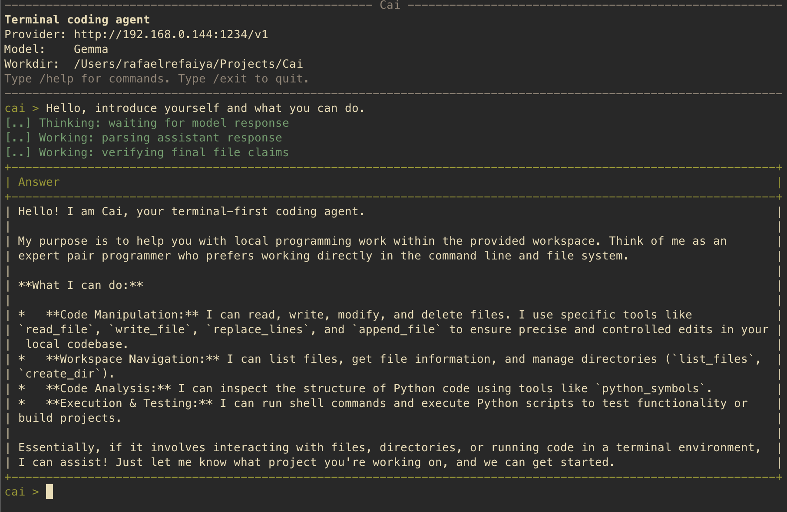

# Cai

**A lightweight terminal coding agent for hosted APIs and local models.**

Cai can inspect, edit, and validate projects from the command line. It supports
OpenAI-compatible APIs, local model servers, command-backed model adapters, and
local model files launched through runners such as `llama-server`.



> Cai is currently alpha software. Review proposed actions and keep important
> work under version control.

## Highlights

- Work interactively with `cai chat` or run one prompt with `cai once`.
- Connect to hosted or local OpenAI-compatible `/chat/completions` endpoints.
- Use native function calling when supported, with resilient text-based tool
  parsing for local models.
- Read, search, create, edit, move, and validate files inside a controlled
  workspace.
- Preview changes, require approvals, create snapshots, and export transcripts.
- Run without third-party runtime dependencies on Python 3.10 or newer.

## Installation

From the project directory, install Cai in editable mode:

```bash
python3 -m pip install -e .
cai --help
```

You can also run Cai without installing the console script:

```bash
python3 -m cai --help
```

## Quick Start

Create a configuration, verify it, and start an interactive session:

```bash
cai setup
cai doctor
cai chat
```

Cai stores its user configuration in `~/.cai/config.json`. The current
directory is used as the workspace unless `--workspace PATH` or
`CAI_WORKSPACE` is set.

Run a single task and exit:

```bash
cai once "Inspect this project and recommend the next test to add."
```

## Provider Setup

### Hosted API

Use any provider that exposes an OpenAI-compatible chat-completions endpoint:

```bash
export OPENAI_API_KEY="..."

cai chat \
  --base-url https://api.openai.com/v1 \
  --api-key-env OPENAI_API_KEY \
  --model "<model-name>" \
  --native-tools
```

### Local API Server

Cai includes presets for Ollama, LM Studio, vLLM, llama.cpp, and
text-generation-webui:

```bash
cai presets
cai chat --preset lm-studio --model "<local-model-name>"
```

You can also provide an endpoint directly:

```bash
cai chat \
  --base-url http://127.0.0.1:1234/v1 \
  --model "<local-model-name>"
```

### Local Model File

Cai can start a local model file through an installed runner:

```bash
cai chat \
  --local-model "/path/to/model.gguf" \
  --runner-command "llama-server --model {model_path} --port {port}" \
  --model local-model
```

If `--runner-command` is omitted, Cai looks for `llama-server` or
`llama-cpp-server` on `PATH`.

### Command Adapter

A custom command can act as the model provider. It receives conversation JSON
on standard input and prints assistant text on standard output:

```bash
cai once \
  --provider command \
  --command-provider-argv "python3 ./my-provider-wrapper.py" \
  "Summarize this workspace."
```

## Safety Model

Cai uses conservative defaults for operations that affect the system:

- File tools are restricted to the active workspace.
- Writes, deletions, moves, and shell commands require approval.
- `--dry-run` previews file changes without applying them.
- `--snapshot-dir PATH` saves existing files before modification.
- File-size, shell-timeout, and command-output limits are configurable.
- `Ctrl-C` interrupts model generation without ending an interactive session.

Use `-y` or `--yes` only in trusted workspaces; it auto-approves write and shell
actions.

## Main Commands

| Command | Purpose |
| --- | --- |
| `cai setup` | Create or update the saved configuration. |
| `cai doctor` | Validate provider, model, workspace, and runner settings. |
| `cai presets` | List built-in local-server presets. |
| `cai chat` | Start an interactive coding session. |
| `cai once "..."` | Run one task and exit. |
| `cai config` | Inspect or change saved configuration values. |

Run `cai <command> --help` for all available options.

## Development

Install the development tools and run the same checks used by CI:

```bash
python3 -m pip install -e '.[dev]'
python3 -m ruff check cai tests
python3 -m mypy cai tests
python3 -m unittest
```

The test suite covers the agent loop, model-response parsing, workspace tools,
configuration, provider adapters, transcript export, and local integration
paths.

## Documentation

- [Operating Guide](OPERATING.md): provider configuration and runtime details.
- [Feature Reference](FEATURES.md): supported tools, controls, and behavior.
- [Contributing Guide](CONTRIBUTING.md): development setup and change checks.
- [Project Backlog](todo.md): planned improvements and open work.
